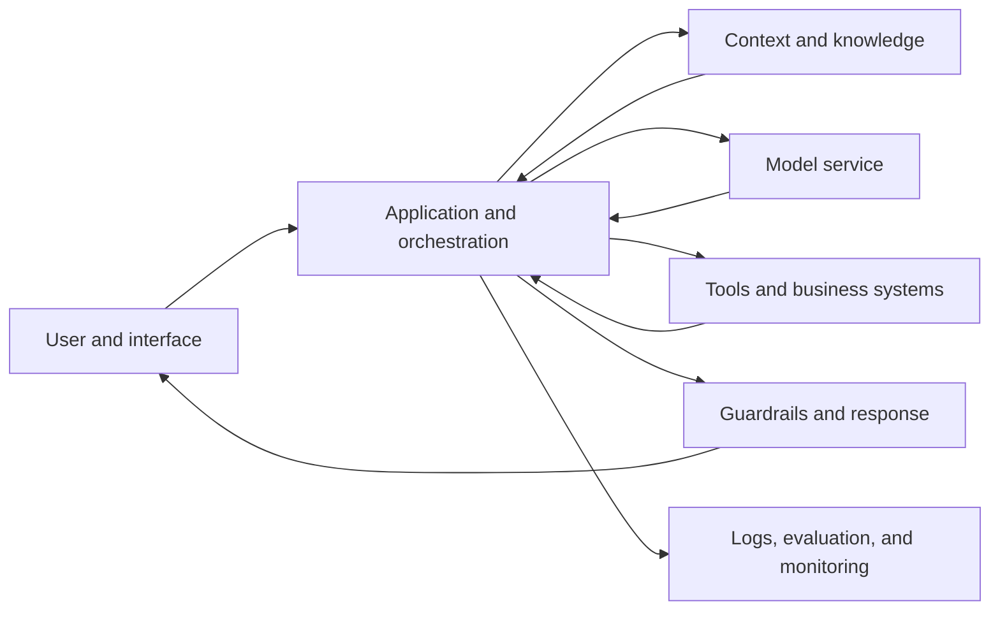
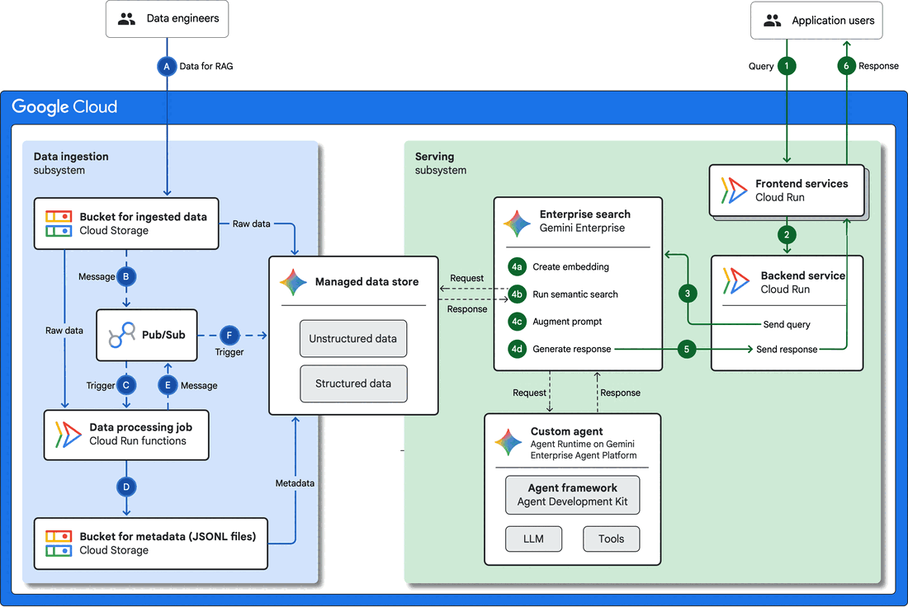
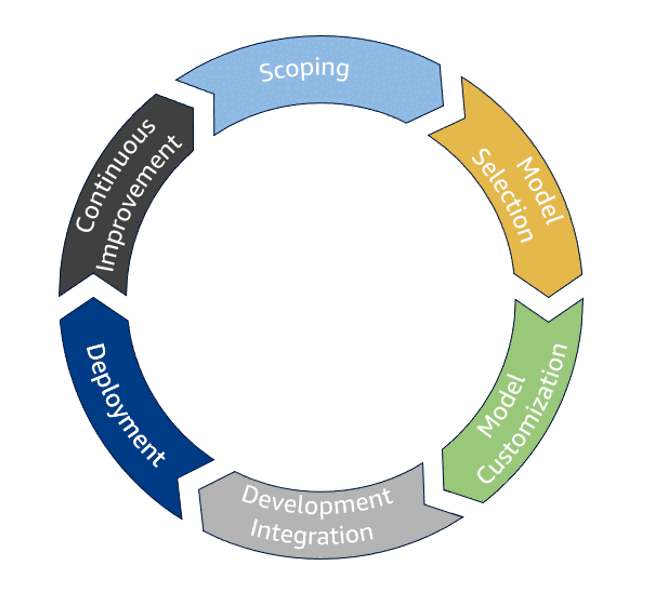

# Anatomy of a GenAI System

A generative AI feature is not just a model. It is a software system that
collects a request, assembles context, calls one or more models or services,
applies controls, returns an experience, and produces evidence about what
happened. A failure at any layer can look like a "bad model" to the user.

## A Product-Level System Map

The boxes are responsibilities, not required products. A small application may
combine several responsibilities in one service; a larger organization may
separate them across teams and vendors.

## Follow One Request

1. **Interface:** captures the user's request, identity, and relevant settings.
2. **Application:** checks access, loads state, and decides which workflow runs.
3. **Context assembly:** combines instructions, conversation state, retrieved
   documents, structured data, and tool results within a limited context window.
4. **Model call:** sends an input to a selected model with parameters such as
   maximum output length and randomness.
5. **Post-processing:** validates, filters, cites, formats, or routes the output.
6. **Action or response:** shows content to a person or requests an operation in
   another system.
7. **Telemetry:** records enough information to evaluate quality, latency, cost,
   safety, and failures without exposing unnecessary sensitive data.

*Source: Google Cloud, [RAG infrastructure for generative AI](https://docs.cloud.google.com/architecture/rag-genai-gemini-enterprise-vertexai), licensed under [CC BY 4.0](https://creativecommons.org/licenses/by/4.0/). The vendor services are examples; focus on the separation between ingestion and serving flows.*

## Two Flows, Not One

A knowledge-grounded application usually has at least two distinct flows:

- **Ingestion flow:** collect, clean, split, label, embed, index, version, and
  remove source content.
- **Serving flow:** authenticate the user, interpret the request, retrieve
  permitted context, generate a response, apply controls, and log the result.

Outdated answers may come from a failed ingestion job even when retrieval and
generation work exactly as designed. Privacy leakage may come from retrieval
permissions even when the model follows its prompt.

## Architecture Questions for PMs

| Question | Why it matters |
|---|---|
| What decision or task does the system support? | Defines the required quality and acceptable error. |
| Which data crosses each boundary? | Reveals privacy, access, residency, and retention concerns. |
| Which component owns the final decision? | Prevents accountability from being delegated to the model. |
| What happens when a dependency is slow or unavailable? | Defines fallback and user communication. |
| Which versions produced this response? | Makes regressions reproducible. |
| How can a user correct or challenge the result? | Creates recovery and feedback paths. |

## Architecture Evolves Across the Lifecycle

*Source: AWS Well-Architected Framework, [Generative AI lifecycle](https://docs.aws.amazon.com/wellarchitected/latest/generative-ai-lens/generative-ai-lifecycle.html). The lifecycle is a useful reminder that model selection is one decision among scoping, customization, integration, deployment, and continuous improvement.*

Architecture is not finished at launch. New user behavior, source content,
models, regulations, costs, and failure evidence can change the appropriate
design. Every significant component change should therefore identify what must
be reevaluated and how the team can roll back.

## Check Your Understanding

**Question:** A policy assistant gives an obsolete reimbursement limit. Why is
"replace the model" an incomplete diagnosis?

Show solution

The source document may be obsolete, ingestion may have failed, both policy
versions may be indexed, metadata filtering may be missing, retrieval may rank
the wrong passage, or cached context may be stale. The team needs evidence from
the complete request path before changing the model.

## Further Reading

- [Google Cloud: RAG infrastructure and data flow](https://docs.cloud.google.com/architecture/rag-genai-gemini-enterprise-vertexai)
- [Google Cloud: Deploy and operate generative AI applications](https://docs.cloud.google.com/architecture/deploy-operate-generative-ai-applications)
