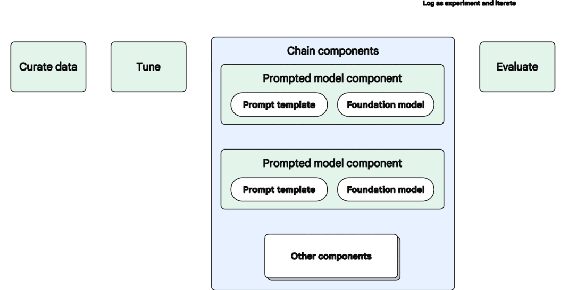
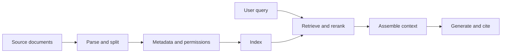

# Context, Retrieval, Memory, and Adaptation

Many architecture discussions confuse five different needs: giving instructions,
supplying current knowledge, preserving state, accessing live systems, and
changing model behavior. Each need has a different mechanism and operating cost.

## Match the Need to the Mechanism

| Need | Typical mechanism | Good fit | Important limitation |
|---|---|---|---|
| Define task and format | Prompt and structured output | Instructions that change quickly | Competing or ambiguous instructions can still fail |
| Supply current or private knowledge | RAG or direct context | Policies, support articles, product documentation | Retrieval quality and permissions become critical |
| Preserve user or workflow state | Session state or explicit memory | Preferences and multi-step tasks | Stale or cross-user state creates harm |
| Read or change live information | API or tool call | CRM lookup, booking, analytics query | Requires authorization, validation, and failure handling |
| Improve repeated task behavior | Fine-tuning | Stable patterns with representative examples | Does not reliably inject current factual knowledge |
| Change capability or economics | Model selection | Quality, latency, modality, context, or cost needs | A stronger model cannot repair broken data flow |

*Source: Google Cloud, [Deploy and operate generative AI applications](https://docs.cloud.google.com/architecture/deploy-operate-generative-ai-applications), licensed under [CC BY 4.0](https://creativecommons.org/licenses/by/4.0/).*

## RAG Is a Pipeline

Retrieval-augmented generation adds selected external information to the model's
input. It does not make every source true, current, relevant, or authorized.

Quality can fail at every step:

- extraction loses tables or headings;
- chunks separate a rule from its exception;
- metadata omits date, region, or audience;
- access filters are missing;
- the query uses different language from the source;
- too many weak passages crowd out the strongest evidence;
- citations point to a retrieved source that does not support the claim.

Measure retrieval separately from generation. If the correct passage never
reaches the model, changing the prompt cannot reliably solve the problem.

## Conversation Is Not Automatically Memory

The visible chat history, a session summary, a user profile, and durable task
state are different artifacts. For each one, decide:

- what is stored and for how long;
- who may read, update, or delete it;
- whether the user can inspect or correct it;
- how conflicts and stale values are handled;
- what the system should forget.

More memory is not always better. Irrelevant history consumes context, stale
preferences distort decisions, and shared state can leak one person's data to
another.

## Choose the Smallest Effective Change

Start with the least complex intervention that addresses the verified cause:

1. Fix the workflow, source content, or product expectation.
2. Improve instructions, examples, validation, or structured output.
3. Add or repair retrieval for changing knowledge.
4. Add explicit state for a real continuity need.
5. Integrate a tool for authoritative live data or action.
6. Fine-tune only when repeated behavior remains inadequate and good training
   and evaluation examples exist.
7. Change the model when capability, context, latency, modality, or economics
   are the measured constraint.

## Check Your Understanding

**Question:** A sales-email system uses yesterday's account status. Should the
team fine-tune the model on more CRM exports?

Show solution

Probably not. Current account status belongs in a live, authorized CRM lookup or
a reliably refreshed data pipeline. Fine-tuning is not a dependable mechanism
for frequently changing facts and creates a new data-governance burden.

## Further Reading

- [Google Cloud: Model chaining and augmentation](https://docs.cloud.google.com/architecture/deploy-operate-generative-ai-applications#model-chaining)
- [Original RAG paper](https://arxiv.org/abs/2005.11401)
