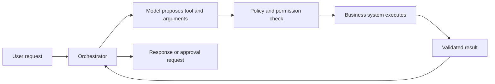
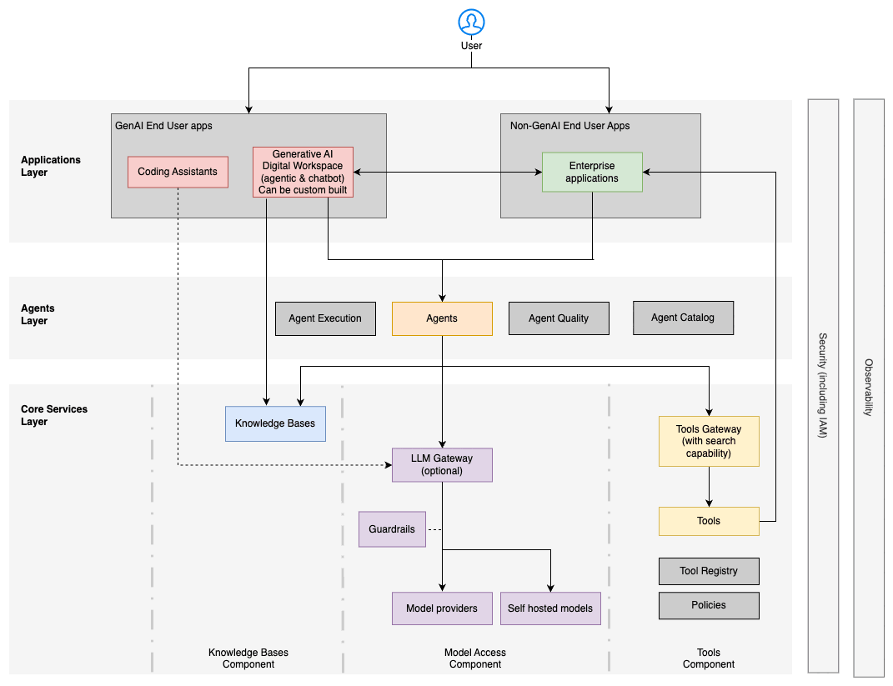
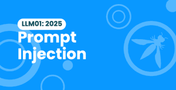

# Tools, Workflows, and Trust Boundaries

An AI system becomes more useful when it can retrieve live data or request an
action. It also becomes more consequential. A generated sentence can be reviewed;
an authorized refund, deleted record, or sent email changes the real world.

## From Answering to Acting

The model may propose an action, but deterministic software and downstream
systems must enforce identity, authorization, input validation, business rules,
rate limits, and audit logging.

*Source: AWS Prescriptive Guidance, [Agentic AI architecture in the enterprise](https://docs.aws.amazon.com/prescriptive-guidance/latest/govern-architect-agentic-ai/enterprise-architecture.html). The diagram is one vendor reference architecture, not a mandatory stack.*

## Mark the Trust Boundaries

A trust boundary is a point where data or authority moves between contexts with
different owners, permissions, or assumptions. Common boundaries include:

- user input entering the application;
- private documents entering an index;
- retrieved text entering the model context;
- model output becoming executable arguments;
- a third-party model receiving company data;
- an action crossing into CRM, HR, finance, or messaging systems;
- logs moving into analytics or support tools.

At each boundary, ask what must be authenticated, authorized, minimized,
validated, logged, retained, and recoverable.

## Capability, Permission, and Autonomy

Risk grows along three independent dimensions:

- **Capability:** which operations are available?
- **Permission:** which data and systems may those operations access?
- **Autonomy:** how many decisions or actions can occur without human review?

A support assistant may need to read an order but not modify it. A refund tool
may need a transaction limit and explicit approval. A batch workflow may need a
stop condition even if each individual operation is low risk.

## Guardrails Need Layers

A system prompt is an instruction, not an authorization boundary. Combine
controls at the appropriate layer:

| Layer | Example control |
|---|---|
| Interface | Confirm high-impact actions and explain consequences |
| Application | Limit workflow steps, retries, and allowed operations |
| Tool contract | Validate typed inputs and reject unsupported fields |
| Identity and access | Apply least privilege and tenant-aware authorization |
| Data | Filter by permissions before retrieval and minimize sensitive fields |
| Output | Encode, validate, cite, or route uncertain results to review |
| Operations | Log actions, alert on anomalies, rate-limit, and support rollback |

*Source: OWASP GenAI Security Project, [LLM01: Prompt Injection](https://genai.owasp.org/llmrisk/llm01-prompt-injection/).*

Prompt injection is an architectural concern because untrusted instructions can
arrive through user input, retrieved documents, web pages, emails, or tool
results. The design must assume that natural-language context can be hostile.

## Check Your Understanding

**Question:** An onboarding assistant only needs to explain HR tasks. Its
integration can also delete employee records. Is a prompt saying "never delete"
enough?

Show solution

No. Remove the unnecessary operation or issue read-only credentials. Enforce
authorization in the downstream system, validate every tool request, and require
human approval for any justified high-impact action. Prompt instructions are an
additional control, not the permission boundary.

## Further Reading

- [OWASP Top 10 for LLM Applications](https://genai.owasp.org/llm-top-10/)
- [OWASP: Excessive Agency](https://genai.owasp.org/llmrisk/llm062025-excessive-agency/)
- [AWS: Governing agentic AI systems](https://docs.aws.amazon.com/prescriptive-guidance/latest/govern-architect-agentic-ai/)
