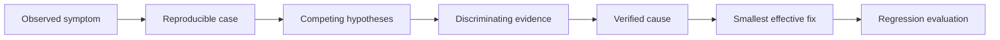
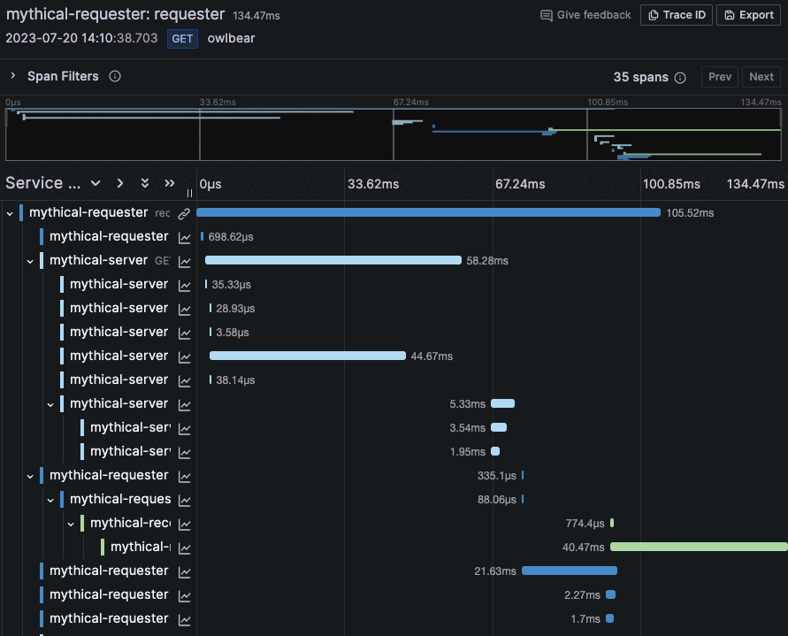

# Diagnose AI System Failures

A symptom is what someone observes. A root cause is the condition that must
change to prevent recurrence. Jumping directly from symptom to favorite fix is
solutioneering, not diagnosis.

## Use an Evidence Ladder





*Source: Grafana Labs, [Traces in Explore](https://grafana.com/docs/grafana/latest/visualizations/explore/trace-integration/). A trace can reveal which component ran, failed, retried, or dominated end-to-end latency.*

For every claim, label it:

- **Observed:** directly visible in a user report, trace, log, test, or source.
- **Inferred:** a plausible explanation consistent with current evidence.
- **Unknown:** information needed before choosing confidently.
- **Verified:** tested evidence distinguishes this cause from alternatives.

## Symptom-to-Layer Map

| Symptom | Plausible causes to distinguish | Useful evidence |
|---|---|---|
| Outdated answer | stale source, failed ingestion, duplicate versions, cache, weak date filter | source versions, ingestion status, retrieved chunks, cache age |
| Irrelevant answer | ambiguous query, poor chunking, weak retrieval, context crowding, model disregard | query, ranked passages, retrieval scores, final prompt |
| Forgotten context | state not stored, summary loss, wrong session, context truncation, intentional expiry | session ID, state snapshot, token use, retention policy |
| Inconsistent format | underspecified contract, randomness, model-version change, parser fallback | prompt version, model version, parameters, parse errors |
| Hallucinated claim | missing evidence, failed retrieval, unsupported synthesis, misleading source | retrieved evidence, citations, supported-claim evaluation |
| Slow response | retrieval, model latency, long context, sequential tools, retries, dependency outage | component timings, token counts, traces, timeout and retry logs |
| Privacy leak | bad authorization, cross-user state, overbroad retrieval, sensitive logs, unsafe tool output | identity, permissions, retrieved context, audit logs, data lineage |
| Quality decline | source drift, traffic shift, prompt/model change, evaluation blind spot | version history, cohort metrics, fixed evaluation set, change log |

## Ask for Evidence That Separates Hypotheses

Good evidence changes the ranking of possible causes. If answers are outdated,
checking whether the current document exists in the source system does not tell
you whether it reached the index. Inspect the ingestion record and the passages
actually retrieved for a failing query.

Use the **next-best-evidence** question:

> What is the smallest observation or test that would most change our diagnosis?

Examples include reproducing one failing request, comparing retrieved passages
with the expected passage, removing conversation history, pinning the model
version, or measuring component-level latency.

## Fix the Cause and Protect Against Regression

A complete recommendation contains:

1. immediate containment for affected users;
2. a change linked to verified or strongly supported causes;
3. a regression test using the original failure;
4. monitoring that detects recurrence;
5. an owner, rollback condition, and unresolved risk.

Do not list "improve prompt, add RAG, fine-tune, and change model" as a package
unless evidence shows each intervention is necessary. Multiple simultaneous
changes make it difficult to learn which one worked.

## Use an LLM as a Challenger

Give the LLM your map and evidence, then ask it to find alternatives:

```text
Review this AI-system diagnosis as a skeptical architecture panel.
Separate observations from inferences. Identify at least three competing root
causes, the evidence that would distinguish them, and any proposed fix that is
not linked to evidence. Do not invent logs, architecture, users, or constraints.
Flag claims that require an engineer, system owner, or primary source.
```

Verify every consequential suggestion. A polished causal story is still only a
hypothesis if the LLM cannot inspect the real system.

## Check Your Understanding

**Question:** Latency increased after a prompt update. Does that prove the new
prompt is the root cause?

<details><summary>Show solution</summary>

No. The timing is evidence worth investigating, but model load, retrieval,
context size, tool retries, traffic mix, or another release may also explain the
change. Compare component timings and versions under reproducible requests.

</details>

## Further Reading

- [Google Cloud: Generative AI operations](https://docs.cloud.google.com/architecture/deploy-operate-generative-ai-applications)
- [OpenTelemetry: Traces](https://opentelemetry.io/docs/concepts/signals/traces/)
