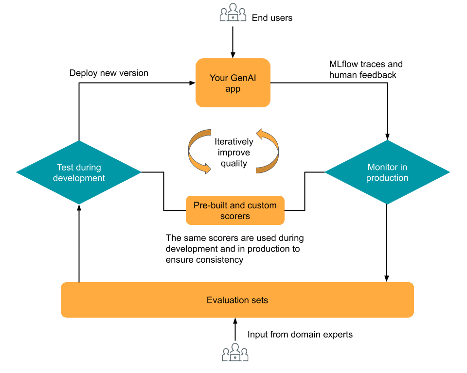
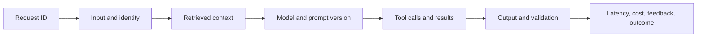
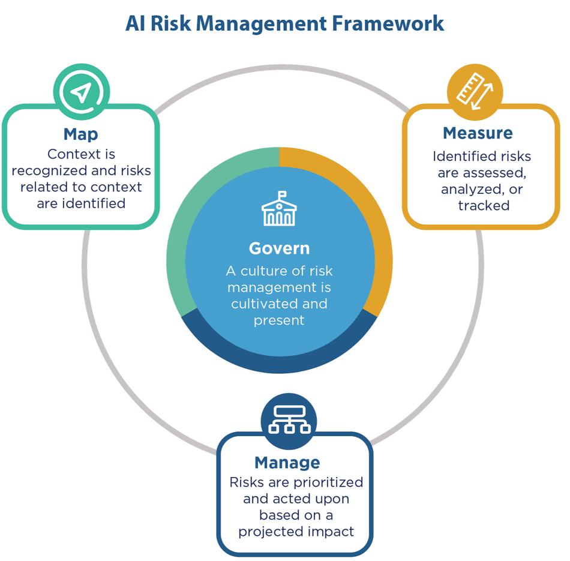

# Evaluation, Observability, and Governance

An architecture is incomplete if the team cannot tell whether it works, why it
failed, or when it should stop. Evaluation measures expected behavior;
observability explains actual runs; governance defines ownership and acceptable
operation. The three must connect.

## Evaluate the System at Several Levels

| Level | Example question | Example measure |
|---|---|---|
| Business | Does the workflow create worthwhile value? | resolution rate, avoided loss, adoption |
| User task | Can people complete the task safely? | task success, correction rate, escalation rate |
| Retrieval | Did the system find permitted supporting evidence? | recall at k, relevance, permission violations |
| Generation | Is the answer supported and useful? | groundedness, factuality, format adherence |
| Tool or action | Was the right operation executed correctly? | valid-call rate, unauthorized attempts, reversals |
| Operations | Is the service sustainable and reliable? | latency, availability, token use, cost per task |
| Risk and equity | Who is harmed or underserved? | safety incidents, subgroup failures, privacy events |

One aggregate score hides trade-offs. A support assistant can improve average
response time while increasing unsupported promises. Pair outcome metrics with
guardrails and inspect important cohorts separately.

## Build Evaluation Before the Fix

A small evaluation set should include:

- normal representative cases;
- difficult but valid edge cases;
- the reported failure and nearby variants;
- cases where the correct response is refusal or escalation;
- multilingual or subgroup cases relevant to the product;
- malicious or malformed inputs where appropriate.

Version the dataset, prompts, retrieval configuration, model, tool contracts,
and graders. Otherwise a score cannot be reproduced or compared fairly.

*Source: Microsoft Learn and Azure Databricks, [Evaluate and monitor AI agents](https://learn.microsoft.com/en-us/azure/databricks/mlflow3/genai/eval-monitor). This is one platform example; the transferable principle is to reuse explicit quality criteria across development and production while incorporating domain-expert feedback.*

## Observe the Whole Request

Collect only what is necessary and permitted. Raw prompts, retrieved passages,
and model outputs may contain personal or confidential data. Define access,
redaction, retention, and deletion policies for telemetry itself.

## Manage Risk Continuously

*Source: NIST, [AI Risk Management Framework Core](https://airc.nist.gov/airmf-resources/airmf/5-sec-core/).*

The NIST AI RMF organizes risk work around four connected functions:

- **Govern:** assign accountability, policies, documentation, and escalation.
- **Map:** understand context, users, impacts, dependencies, and intended use.
- **Measure:** test performance and risk with appropriate evidence.
- **Manage:** prioritize controls, monitor operation, and make release decisions.

Governance is not a final approval meeting. It changes system design: which
data is available, who can act, which traces exist, when a human intervenes, and
how the product degrades or rolls back.

## Define Operating Decisions

Before launch or remediation, state:

- who owns product quality, data, model configuration, security, and incidents;
- which thresholds trigger review, rollback, or shutdown;
- what fallback users receive during dependency failure;
- how feedback becomes a verified improvement rather than automatic training;
- how source, prompt, model, and workflow changes are approved and evaluated;
- what evidence is required to declare the incident resolved.

## Check Your Understanding

**Question:** A team monitors thumbs-up rate and average latency. Can it diagnose
an increase in unsupported answers?

Show solution

Not reliably. It needs a stable supported-answer evaluation, retrieval evidence,
prompt and model versions, traces for failing requests, and relevant user or
content cohorts. User feedback is useful but incomplete and often selective.

## Further Reading

- [NIST AI RMF 1.0](https://nvlpubs.nist.gov/nistpubs/ai/NIST.AI.100-1.pdf)
- [NIST Generative AI Profile](https://nvlpubs.nist.gov/nistpubs/ai/NIST.AI.600-1.pdf)
- [Google Cloud: Evaluate generative AI applications](https://docs.cloud.google.com/vertex-ai/generative-ai/docs/models/evaluation-overview)
