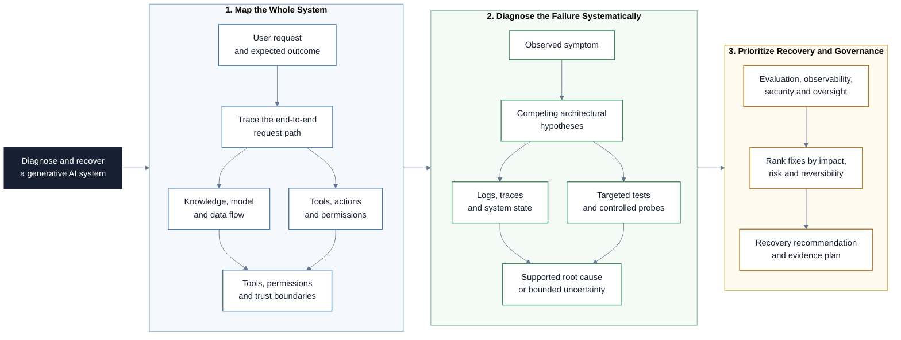

# AI Architecture

This repository helps AI PMs understand how production generative
AI systems are assembled, where they fail, and which evidence is needed before
changing the architecture. Participants learn to map an AI system from user
request to response, distinguish model problems from application problems, and
turn symptoms into testable hypotheses and prioritized product decisions.

## Project at a Glance

The project maps a generative AI system, traces a visible failure through its
layers, and turns verified evidence into a prioritized recovery plan.

## Learning Objectives

By the end of this repository, you should be able to:

- Map the main components and data flows of a generative AI application.
- Explain the roles of prompts, retrieval, memory, tools, models, and guardrails.
- Choose between prompting, RAG, fine-tuning, and workflow changes based on the
  problem rather than the popularity of a technique.
- Trace visible failures to several plausible architectural causes.
- Distinguish a symptom, a hypothesis, supporting evidence, and a root cause.
- Define evaluation, observability, security, and human-oversight requirements.
- Prioritize fixes by impact, evidence, effort, risk, and reversibility.
- Use an LLM to challenge a diagnosis without treating its answer as proof.

## Learning Path

The modules build on each other in order.

| File / Folder | Description |
|---|---|
| [**01 - Anatomy of a GenAI System**](01-anatomy-of-a-genai-system.md) | Follow a request through the product, orchestration, knowledge, model, and operational layers. |
| [**02 - Context, Retrieval, Memory, and Adaptation**](02-context-retrieval-memory-and-adaptation.md) | Decide what information belongs in prompts, RAG, memory, tools, or model adaptation. |
| [**03 - Tools, Workflows, and Trust Boundaries**](03-tools-workflows-and-trust-boundaries.md) | Understand how integrations increase capability, permissions, and failure impact. |
| [**04 - Diagnose Failures Systematically**](04-diagnose-ai-system-failures.md) | Move from user-visible symptoms to competing hypotheses, tests, and root causes. |
| [**05 - Evaluation, Observability, and Governance**](05-evaluation-observability-and-governance.md) | Design the evidence and controls required to operate an AI system responsibly. |
| [**06 - Session Handout**](06-session-handout.md) | Diagnose one GenAI system failure and defend a prioritized recovery plan. |

### Additional Folders and Files

| File / Folder | Description |
|---|---|
| [**assets**](assets/) | Local diagrams and sourced illustrations used throughout the lessons. |
| [**templates**](templates/) | Reusable system-map, diagnosis, and recommendation templates. |
| [**LICENSE**](LICENSE) | MIT license for the repository. |

## Getting Started

No Python environment or coding is required.

1. Create a repository from this template and add collaborators when working in
   a group.
2. Open the repository with any editor or AI assistant that can access the
   project files.
3. Read the lesson files in numerical order.
4. Complete the handout using the templates as working documents.
5. Keep observed facts, assumptions, AI suggestions, and verified evidence
   visibly separate.

## AI Collaboration Guidelines

Start with a human system map and first diagnosis. An LLM can explain unfamiliar
terms, generate alternative hypotheses, challenge assumptions, and improve the
clarity of a recommendation. It cannot inspect unavailable logs, confirm the
real architecture, prove a root cause, or authorize a production change. Never
enter sensitive data, credentials, private conversations, or personal data into
an unapproved tool.

## References & Further Reading

- [Google Cloud: Deploy and operate generative AI applications](https://docs.cloud.google.com/architecture/deploy-operate-generative-ai-applications)
- [Google Cloud: RAG infrastructure reference architecture](https://docs.cloud.google.com/architecture/rag-genai-gemini-enterprise-vertexai)
- [AWS: Agentic AI architecture in the enterprise](https://docs.aws.amazon.com/prescriptive-guidance/latest/govern-architect-agentic-ai/enterprise-architecture.html)
- [NIST: AI Risk Management Framework](https://www.nist.gov/itl/ai-risk-management-framework)
- [OWASP: Top 10 for LLM Applications](https://genai.owasp.org/llm-top-10/)
