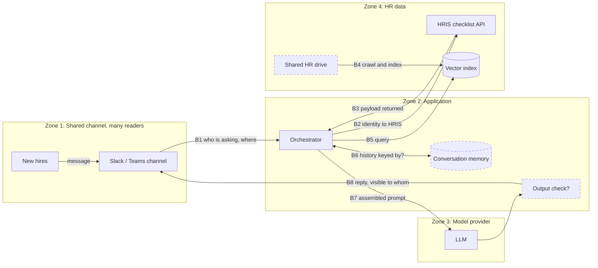

# AI System Map: HR-Onboarding Assistant (Slack/Teams bot)

Legend: **[K]** known from the case description, **[A]** assumption to verify, **[S]** synthetic exercise detail (kept stable). Causes are not asserted here. They are tested in the diagnostic register.

## Case Statement (frozen)

- **Primary failing case [S]:** In the shared `#onboarding-cohort` channel, the assistant posts, visible to every member: "Hi Alex, your visa document is still missing. Please upload it by Friday." A private task reminder about one hire's immigration paperwork is broadcast to the whole cohort.
- **Expected behavior:** The reminder goes only to Alex, in a private direct message, with the minimum detail needed to act.
- **Affected [S]:** Alex (immigration status disclosed) and every channel member who could read the post. How many read it, and whether other hires were affected, is **unknown**.
- **When [S]:** Reported in the current cohort's first weeks. The first occurrence is unknown.
- **Known recent change:** **None known.** It is unknown whether the bot configuration, channel setup, checklist API, or document sources changed.
- **Reported but unconfirmed symptoms [S]:** (a) asked about their status, a hire is told their own home address, phone number or tax status; (b) a general policy question (relocation, salary bands) returns real employee names, past compensation or manager notes. These are used as evidence patterns, not as frozen facts.

## System Context

- **System:** HR-onboarding assistant, a Slack/Teams bot that guides new hires through tasks and policies.
- **Primary user:** A new hire in their first weeks. Secondary: HR coordinators reading task status.
- **Task or decision supported:** Knowing which onboarding tasks are open and what the policies say. It supports the hire's actions, not HR decisions.
- **Expected outcome:** Accurate task reminders and policy answers, delivered privately, built only from data the hire may see.
- **Unacceptable outcome:** Personal data (home address, phone, tax or bank details, immigration status, compensation) shown to anyone but the subject and authorised HR. Another employee's real records in any answer. Private reminders posted in a shared channel.
- **Accountable owner:** Head of People Operations owns the data and the risk **[A]**. The platform team owns the bot and orchestrator **[A]**. IT/Security owns the workspace, identity and shared drives **[A]**.

## Request Flow

Dashed boxes are assumed and unverified. Numbered markers B1 to B8 match the boundary table below.

## Data and Knowledge Flow

| Data or content | Source and owner | Processing or storage | Used when | Freshness requirement |
|---|---|---|---|---|
| Onboarding tasks (name, status, due date) | HRIS checklist API, HR systems owner **[A]** | Live API call **[K]** | Task status and reminders | Real time |
| Full employee profile (address, phone, tax, bank, compensation, immigration) | HRIS, HR **[A]** | Should **not** reach the assistant | Never | n/a |
| Policy documents (handbook, IT guides, benefits) | Company documentation, People Ops **[K]** | Chunked and embedded into a vector index **[K]** | Policy questions | Current version only |
| Raw HR drive files (offer letters, claim templates, tracking sheets) | Shared HR drive, HR **[A]** | Unknown whether crawled | Should never be indexed | n/a |
| Conversation history | Orchestrator memory **[K]** | Short-term session store; key and lifetime unknown **[A]** | Follow-up questions | Session length |
| Channel messages | Slack/Teams workspace, IT **[K]** | Read by the bot; scope unknown **[A]** | Every request | Real time |
| Prompts, config, logs, traces | Platform team **[A]** | Log store, may hold PII **[A]** | Diagnosis, evaluation | Retention unknown |

## Components and Responsibilities

| Component | Responsibility | Input | Output | Owner | Known or assumed? |
|---|---|---|---|---|---|
| Slack/Teams bot interface | Receive messages, post replies and reminders | Channel and DM messages | Posts, ephemeral messages, DMs | IT/Platform | Known (deployed in a shared channel); reply visibility setting assumed |
| Orchestrator | Route messages, compile prompt context, call tools, manage memory | Message, identity, history | Prompt, tool calls, reply | Platform team | Known |
| Checklist integration | Read and write onboarding tasks in the HRIS | Employee ID | Tasks, possibly more | HR systems owner | Known to exist; payload contents assumed |
| RAG pipeline and vector index | Retrieve company documents | Query | Ranked passages | Platform, People Ops | Known; source folders and filters assumed |
| Conversation memory | Keep multi-turn context | Session key | Prior turns | Platform | Known; key and lifetime unknown |
| LLM | Generate the reply from injected context | Prompt | Draft reply | Platform (provider hosts) | Known |
| Output check | Block sensitive content before posting | Draft reply | Pass, block or redact | Platform/Security | **Unknown** if it exists |
| Identity mapping (Slack user to HRIS employee) | Tie each request to the right person and rights | Slack user ID | Authorised scope | IT/Security | **Unknown** |
| Logs and monitoring | Trace requests, detect regressions | Events | Dashboards, alerts | Platform | Assumed |

## Trust Boundaries and Permissions

| Boundary | Data or authority crossing it | Required control | Failure impact |
|---|---|---|---|
| **B1** Channel → orchestrator | Who asked, in which channel, and everything other members wrote (untrusted text) | Distinguish DM from group channel; treat channel text as untrusted input | Private data answered in public; instructions from other users reach the model |
| **B2** Orchestrator → HRIS | Which identity the call runs as and what it may read | User-scoped or least-privilege access; field-level scope | A broad service account lets the assistant read what the asker may not |
| **B3** HRIS → orchestrator | The API payload | Return, and keep, only the fields the task needs | Whole profile enters the prompt and can be quoted back |
| **B4** Shared drive → index | Which files are crawled | Approved-source allow-list; no raw records or templates | Real employee records become searchable answers |
| **B5** Orchestrator → retrieval | Query and any permission filter | Only general-audience passages returned | Confidential passages placed in context |
| **B6** Orchestrator ↔ memory | Stored turns and tool results | Memory keyed to the individual, short lifetime, no cross-user reuse | One person's data appears in another's context |
| **B7** Context → model | Everything in the prompt can be repeated | Only authorised, minimal data in context | Anything in context can be leaked |
| **B8** Model → channel | Reply and its visibility | Private delivery for personal data; output check | A private reminder becomes a public post |

## Human Oversight and Recovery

- **When must a person review or approve?** Questions about compensation, another person, health, immigration or tax; and any write to HR records. Blocked or out-of-scope requests go to an HR contact **[A]**.
- **How can the user challenge or correct an output?** Report a problem to HR or Security. Reports about exposed data must reach both directly **[A]**.
- **What fallback exists when AI or a dependency fails?** Assumed: links to the approved onboarding documents and an HR help-desk contact. Not verified.
- **Which actions can be reversed?** A public post can be deleted, but not un-read. A disclosure cannot be reversed, so prevention at B3, B4 and B8 matters more than clean-up.

## Architecture Unknowns

| Unknown | Why it matters | Best source or owner to clarify it |
|---|---|---|
| Does the bot reply in the channel by default, when tagged, or only for proactive reminders? Can it send DMs and ephemeral messages? | Explains the public post (B8) | Bot configuration and workspace app permissions; IT/Platform |
| Which fields does the checklist call return, and which reach the prompt? | Explains profile echo (B3) | HRIS API response and orchestrator prompt builder; HR systems owner |
| Which folders does the crawler read, and is anything filtered? | Explains real records in policy answers (B4) | Ingestion configuration and index inventory; Platform |
| How is memory keyed (user, thread, channel) and how long does it last? | Rules cross-user bleed in or out (B6) | Orchestrator design; Platform |
| Which credentials do HRIS calls use, and how is a Slack user mapped to an employee? | Decides whether a user can obtain data they should not (B2) | IAM configuration; IT/Security |
| Is there any output check, and what does it cover? | Last line of defence before posting (B8) | Platform/Security |
| Does the bot read whole-channel history as context? | Untrusted text from other members reaching the model (B1) | Bot scopes and prompt builder; Platform |
| What changed recently? | Gives a trigger and a rollback target | Release log; change owners |
| Who saw the posts, and are copies in logs, exports or the model provider? | Sets severity and notification duties | Security, using workspace and log exports |
