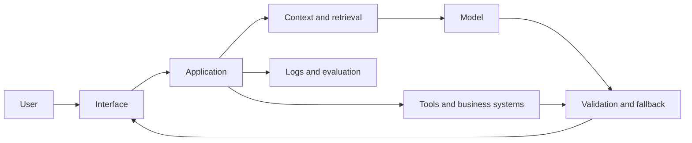

# AI System Map

## System Context

- **System:**
- **Primary user:**
- **Task or decision supported:**
- **Expected outcome:**
- **Unacceptable outcome:**
- **Accountable owner:**

## Request Flow

Map the path from user request to response or action. Include the interface,
application logic, context, model, tools, validation, and fallback that matter
for this system.

## Data and Knowledge Flow

| Data or content | Source and owner | Processing or storage | Used when | Freshness requirement |
|---|---|---|---|---|
|  |  |  |  |  |

## Components and Responsibilities

| Component | Responsibility | Input | Output | Owner | Known or assumed? |
|---|---|---|---|---|---|
|  |  |  |  |  |  |

## Trust Boundaries and Permissions

| Boundary | Data or authority crossing it | Required control | Failure impact |
|---|---|---|---|
|  |  |  |  |

## Human Oversight and Recovery

- **When must a person review or approve?**
- **How can the user challenge or correct an output?**
- **What fallback exists when AI or a dependency fails?**
- **Which actions can be reversed?**

## Architecture Unknowns

| Unknown | Why it matters | Best source or owner to clarify it |
|---|---|---|
|  |  |  |
